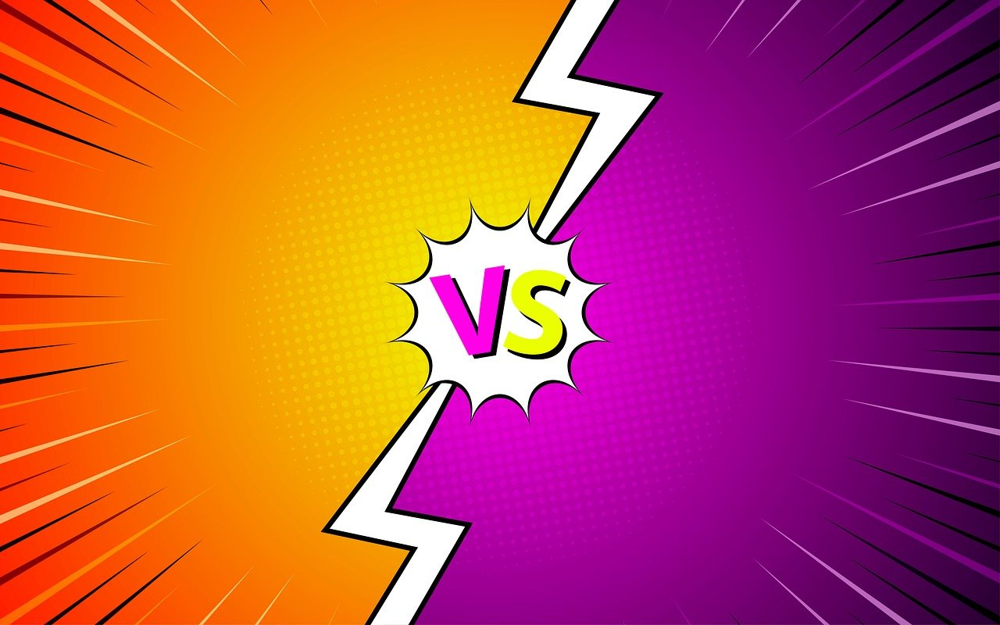

# Rock, Paper, Scissors: The Vision Game

## Obviously, Generated this README using Ai



This project is an interactive, camera-based Rock, Paper, Scissors game developed using Python, Pygame, and OpenCV. It was created as a university assignment to demonstrate skills in computer vision, real-time application development, and game logic. The game features both single-player (vs. AI) and a unique two-player mode where players use hand gestures captured by a webcam.

## Features

- **Computer Vision Powered:** Utilizes a custom-trained YOLOv8 model to detect 'Rock', 'Paper', and 'Scissors' hand gestures in real-time.
- **Two Game Modes:**
    - **1-Player Mode:** Play against an AI that makes a random choice.
    - **2-Player Mode:** Two players face off on a split screen, with the game detecting both of their gestures simultaneously.
- **Interactive Pre-Game Setup:** The 2-Player mode features a fun pre-game sequence where each player's face is captured and displayed on a "Versus" screen.
- **Dynamic UI:** Includes an animated, line-by-line rules screen, a timed countdown, and on-screen score tracking.
- **Polished Experience:** Features background music, sound effects, and a scrolling credits screen to create a complete game feel.

## Technical Stack

- **Pygame:** For the game window, rendering, sound, and event handling.
- **OpenCV (cv2):** For camera capture, image processing, and face detection.
- **Ultralytics YOLOv11:** For real-time hand gesture recognition.
- **NumPy:** For efficient numerical operations on image data.

## Installation & Usage

Follow these steps to set up and run the project on your local machine.

### 1. Prerequisites

- Python 3.8 or higher
- A webcam

### 2. Clone the Repository

```bash
git clone https://github.com/yashasnadigsyn/rock_paper_scissors.git
cd rock_paper_scissors
```

### 3. Install Dependencies
```bash
pip install -r requirements.txt
```

### 4. Run it!
```bash
python3 main.py
```